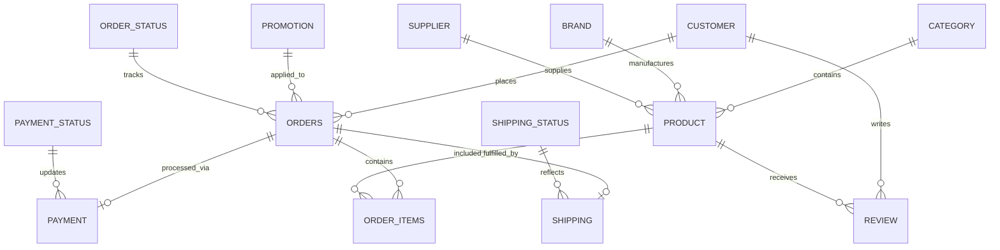

    <h1 style="color: #f8edda; font-family: Georgia, serif; margin: 0 0 15px 0; letter-spacing: 2px;">
        ✦ AURA — E-Commerce Data Analysis
    </h1>
    

        An end-to-end Data Analytics project built from scratch, transforming raw database records into strategic business intelligence to drive profitability, optimize logistics, and understand customer behavior for AURA, a multi-category e-commerce business.
    

## 2. Project Overview

AURA is an e-commerce platform that offers a wide range of products across multiple categories including clothing, shoes, bags, and accessories. This project acts as an end-to-end Data Analytics workflow built entirely from scratch, representing the complete journey of raw transactional data maturing into actionable business insights.

The analysis was performed to uncover hidden patterns in customer purchasing behavior, isolate operational bottlenecks in shipping and payments, and accurately measure product-level profitability. The final outcome of the project is a professional-grade suite of Business Intelligence dashboards that deliver a holistic view of the company's performance, going beyond simple sales volume to measure true profitability and operational efficiency.

---

## 3. Objectives

The primary analytical objectives of this project span multiple business domains:

*   **Sales Performance**: Monitor overall revenue, total order volume, and identify high-level sales trends over time.
*   **Customer Behavior**: Segment customers by age, location, and acquisition channel to understand who is buying and how they are acquired.
*   **Product Performance**: Identify best-selling items, top-performing categories, and assess product quality through customer ratings.
*   **Profitability**: Go beyond top-line revenue by calculating true profit margins, Cost of Goods Sold (COGS), and isolating the most profitable brands.
*   **Marketing Performance**: Evaluate the effectiveness of signup channels (e.g., direct, Google Ads) in generating active, high-value customers.
*   **Shipping Performance**: Track delivery times and carrier performance to ensure logistical efficiency and customer satisfaction.
*   **Payment Performance**: Analyze preferred payment methods and monitor transaction failure rates to optimize the checkout experience.
*   **Order Behavior**: Analyze basket sizes and average order values to identify cross-selling opportunities.
*   **Customer Reviews**: Connect product ratings with sales performance to understand the impact of customer feedback on profitability.
*   **Operational Efficiency**: Combine shipping and payment statuses to flag areas causing order cancellations or delays.

---

    <h2 style="color: #f8edda; font-family: Georgia, serif; margin: 0; letter-spacing: 2px;">
        ✦ 4. Dataset Overview
    </h2>

The underlying database consists of **14 relational tables** covering the entire e-commerce lifecycle, designed to mimic a realistic production environment.

### Customers
Stores customer demographics, signup channels, age, gender, and geographical location.

### Products / Categories / Brands / Suppliers
Contains the complete product catalog, tracking product-level attributes, target demographics, unit costs, pricing, and supplier relationships.

### Orders / Order_Items
Captures transaction-level purchase details, linking customers to the specific quantities and prices of items they bought.

### Payments / Payment_Status
Records the financial transaction details, including payment methods, transaction amounts, and whether the payment was successful or failed.

### Shipping / Shipping_Status
Monitors the logistical timeline, including shipping dates, delivery dates, current shipping status (e.g., Delivered, Returned), and carrier performance.

### Promotions
Contains discount codes, campaign types, and promotion percentages applied to orders.

### Reviews
Stores post-purchase customer feedback, including quantitative product ratings and review dates.

---

## 5. Data Analysis Workflow

The project follows a rigorous, step-by-step analytical workflow, ensuring data integrity from the database to the final dashboard.

### 5.1 Data Collection
The workflow begins with raw data housed in a SQL Server relational database. Data is extracted via customized queries and direct database connections using Python (`pyodbc`).

### 5.2 Data Understanding
Initial exploration involved mapping out the dataset structure, verifying the 14 tables, defining primary/foreign key relationships, examining data types, and identifying key analytical entities like profitability and delivery timelines.

### 5.3 Data Cleaning
Robust data quality checks were performed to ensure dashboard accuracy:
*   **Handling Missing Values**: Using SQL functions like `ISNULL` to handle missing promotional discounts.
*   **Data Validation**: Checking for duplicate records and ensuring primary keys maintained integrity.
*   **Standardizing Text**: Ensuring uniform status naming conventions across payments, shipping, and order statuses.
*   **Date Validation**: Dynamically calculating customer age using `DATEDIFF` relative to the current date and birthdate.

### 5.4 Data Transformation
Raw transactional data was transformed into analysis-ready views. This involved calculating item-level costs (`Quantity * Unit_Cost`), item profit (`Total_Price - Total_Cost`), and determining order-level metrics like the first item in an order using Window Functions.

### 5.5 Exploratory Data Analysis
EDA was conducted using Python (Pandas, Matplotlib, Seaborn) to uncover underlying distributions (such as customer age), detect outliers, and establish baseline patterns before building formal dashboards.

### 5.6 KPI Development
Business metrics were formally defined. Formulas were established for critical KPIs such as Average Order Value, Profit Margin %, and Delivery Time, ensuring consistent calculations across all reporting tools.

### 5.7 Visualization
Finally, the cleaned and modeled data was ingested into Power BI and Excel, where interactive charts, filtering mechanisms, and visual storytelling techniques were applied to surface actionable business insights.

---

    <h2 style="color: #f8edda; font-family: Georgia, serif; margin: 0; letter-spacing: 2px;">
        ✦ 6. SQL Analysis
    </h2>

SQL served as the foundational layer for data extraction, transformation, and validation. The database querying was engineered to handle complex, multi-table relationships efficiently.

The project utilizes comprehensive views (e.g., `VW_DASHBOARD_DATA`, `Unified_Total_Order`) defined in `E_COMMERCE_QUERIERS.sql` to feed the analytical tools. 

Key SQL techniques applied in this workflow include:
*   **Multi-table Analysis & JOINs**: Extensive use of `LEFT JOIN` to flatten the 14-table snowflake/star schema into analytical wide tables, connecting facts (Orders) with dimensions (Customers, Products, Categories, Shipping).
*   **Aggregations & GROUP BY**: Using subqueries to aggregate product reviews (calculating `AVG_RATING` per product) before joining them to the main product catalog.
*   **Window Functions**: Employing `ROW_NUMBER() OVER (PARTITION BY ORDER_ID ORDER BY ORDER_ITEMS_ID)` to identify the primary item in a multi-item basket.
*   **Date Analysis**: Utilizing `DATEDIFF`, `DATENAME`, `YEAR`, and `MONTH` to parse temporal trends and dynamically compute exact customer ages based on their date of birth.
*   **CASE Statements**: Implementing advanced conditional logic to accurately adjust age calculations based on the exact day and month, and flagging records for specific operational statuses.
*   **Data Validation**: Using `ISNULL` to gracefully handle missing values (e.g., defaulting missing discounts to 0) ensuring financial calculations remain accurate.

---

    <h2 style="color: #f8edda; font-family: Georgia, serif; margin: 0; letter-spacing: 2px;">
        ✦ 7. Python Data Analysis
    </h2>

The project includes a Jupyter Notebook named `ecommerce-project.ipynb` containing the Python-based exploratory and analytical work performed on the e-commerce dataset. This notebook is a critical component of the end-to-end workflow, bridging the gap between raw SQL data and finalized BI dashboards.

### Analysis Workflow
The Python workflow initiates by establishing a direct ODBC connection to the SQL Server database. It executes a SQL query to pull the pre-processed `VW_DASHBOARD_DATA` view directly into a Pandas DataFrame, ensuring a seamless data pipeline.

### Python Libraries
*   `pyodbc` (Database connection)
*   `pandas` (Data manipulation and loading)
*   `matplotlib` (Core visualization)
*   `seaborn` (Statistical data visualization)
*   `matplotlib.patheffects` (Advanced chart styling)

### Data Preparation
The notebook performs initial profiling using `df.info()`, `df.describe()`, and programmatic checks for missing values (`df.isna().sum()`) and duplicate records (`df.duplicated().sum()`), guaranteeing the dataset's structural integrity before analysis.

### Exploratory Data Analysis (EDA)
The EDA phase is focused on understanding data distributions and identifying trends. The notebook establishes a cohesive visual language by updating `matplotlib` `rcParams` to match the project's dark-gold aesthetic (`#0b0805` backgrounds, `#d5ad5d` gold accents).

### Visualizations
The analysis utilizes Seaborn to generate statistical visualizations, such as Kernel Density Estimate (KDE) Histograms mapping out the distribution of Customer Age.

### Key Analytical Areas
The Python analysis validates the demographic structure of the customer base and confirms that the transformed SQL views (containing calculated costs, profits, and dynamically parsed dates) are accurate and ready for deployment into Power BI and Excel reporting layers.

---

## 8. Data Modeling

The data architecture is designed around a relational model that elegantly supports both transactional processing and business intelligence reporting. 

### Main Business Entities
The model revolves around core business entities: **Customers**, **Products**, **Orders**, and **Operations** (Shipping/Payments).

### Fact and Dimension Concepts
The structure inherently follows a robust Fact-Dimension design:
*   **Fact Tables**: `ORDERS`, `ORDER_ITEMS`, `PAYMENT`, and `SHIPPING` act as transactional fact tables capturing measurable quantitative data (prices, costs, quantities).
*   **Dimension Tables**: `CUSTOMER`, `PRODUCT`, `CATEGORY`, `BRAND`, and `SUPPLIER` act as dimension tables providing descriptive attributes for filtering and grouping.

### Efficiency and Reporting
By normalizing the database into 14 tables, data integrity is maintained. However, for BI reporting, SQL views successfully denormalize the schema into a cohesive dataset, allowing Power BI to quickly aggregate millions of potential rows without complex, slow DAX joins.

---

    <h2 style="color: #f8edda; font-family: Georgia, serif; margin: 0; letter-spacing: 2px;">
        ✦ 9. KPI Framework
    </h2>

### Sales KPIs
*   **Total Revenue**: The total monetary value generated from all orders.
*   **Total Orders**: The absolute count of transactions processed.
*   **Average Order Value**: `Total Revenue / Total Orders`
*   **Total Customers**: The distinct count of purchasing users.

### Customer KPIs
*   **Total Active Customers**: Count of unique customers who have placed a successful order.
*   **Average Customer Age**: The mean age of the customer base, derived dynamically from birth dates.
*   **Customer Lifetime Value**: The total revenue attributed to an individual customer over their relationship with the business.

### Product & Profitability KPIs
*   **Total Cost of Goods Sold (COGS)**: The total direct costs attributable to the products sold (`Unit Cost × Quantity`).
*   **Total Profit**: `Total Revenue - COGS`
*   **Profit Margin %**: `(Total Profit / Total Revenue) × 100`
*   **Average Product Rating**: The mean customer review score for products.

### Operations KPIs
*   **% Orders Delivered on Time**: The ratio of orders where `Delivery Date <= Expected Date`.
*   **Average Delivery Time**: The mean days elapsed between order placement and delivery.
*   **% Cancelled / Returned Orders**: The ratio of orders flagged with negative shipping/order statuses.
*   **Payment Failed Rate**: The percentage of transactions where payment status resulted in a failure.

---

    <h2 style="color: #f8edda; font-family: Georgia, serif; margin: 0; letter-spacing: 2px;">
        ✦ 10. Power BI Dashboard
    </h2>

## 10.1 Sales Overview

### Objective
Provide a high-level overview of overall sales performance to give executives an immediate understanding of the platform's financial health.

### KPIs
*   Total Revenue
*   Total Orders
*   Average Order Value
*   Total Customers

### Visuals
*   **Monthly Sales Trend** — Line Chart tracking revenue over time.
*   **Top 10 Best-Selling Products** — Bar Chart highlighting volume drivers.
*   **Sales by Category** — Pie / Donut Chart showing category revenue distribution.
*   **Orders by City** — Map visualizing geographic demand.

### Filters
*   Date
*   Category
*   Order Status

**Business Value**: Answers core questions regarding revenue generation trajectories, geographical strongholds, and which categories drive the most top-line growth.

---

## 10.2 Customer Analytics

### Objective
Understand customer demographic characteristics and acquisition behavior to tailor marketing efforts.

### KPIs
*   Total Active Customers
*   Average Customer Age
*   Customer Lifetime Value

### Visuals
*   **Customers by Age Group** — Histogram/Bar chart showing demographic concentrations.
*   **Customers by Signup Channel** — Chart evaluating marketing acquisition success.
*   **Customers by City** — Geographic breakdown of the user base.
*   **Top 10 Customers by Spending** — Leaderboard of the highest-value clients.

### Filters
*   Gender
*   Age Group
*   City

**Business Value**: Identifies the most lucrative customer segments, allowing the marketing team to optimize ad spend across successful signup channels and demographic profiles.

---

## 10.3 Product & Profitability

### Objective
Analyze product performance with a strict emphasis on profitability rather than just top-line sales volume.

### KPIs
*   Total Cost of Goods Sold
*   Total Profit
*   Profit Margin %
*   Average Product Rating

### Visuals
*   **Top 10 Products by Profit** — Highlighting items that actually drive bottom-line success.
*   **Lowest-Rated Products** — Identifying quality issues impacting customer satisfaction.
*   **Brand Performance Table** — Detailed matrix of sales, cost, and margin by brand.
*   **Price vs Rating Scatter Plot** — Analyzing the relationship between product cost and customer perception.

### Filters
*   Brand
*   Supplier
*   Category

**Business Value**: Prevents the business from scaling un-profitable products by revealing the true margins behind high-volume sellers. It bridges the gap between financial performance and customer satisfaction (ratings).

---

## 10.4 Operations — Shipping & Payments

### Objective
Analyze operational efficiency, logistical friction, and payment gateway performance.

### KPIs
*   % Orders Delivered on Time
*   Average Delivery Time
*   % Cancelled / Returned Orders
*   Payment Failed Rate

### Visuals
*   **Orders by Shipping Status** — Breakdown of items in transit, delivered, or returned.
*   **Average Delivery Time by Carrier** — Logistical performance comparison between carriers.
*   **Payment Method Distribution** — Customer preferences for checkout options.
*   **Cancelled Orders Trend Over Time** — Tracking operational failures chronologically.

**Business Value**: Crucial for operational decision-making, helping logistics teams identify slow carriers and assisting finance in diagnosing payment gateway bottlenecks that cause cart abandonment.

---

    <h2 style="color: #f8edda; font-family: Georgia, serif; margin: 0; letter-spacing: 2px;">
        ✦ 11. Excel Dashboard
    </h2>

In addition to Power BI, the project includes a fully functional Excel-based dashboard to support ad-hoc analysis and provide an alternative reporting interface for stakeholders comfortable with spreadsheet environments.

The Excel dashboard consolidates the critical metrics, utilizing Pivot Tables, slicers, and conditional formatting to present an interactive overview of sales volumes and demographic summaries, proving proficiency in traditional BI tools.

---

## 12. Dashboard Design

The visual identity of the AURA dashboards is highly deliberate, projecting a premium, elegant e-commerce brand feel. The README mirrors this design language.

*   **Primary Dark Background**: `#0b0805`
*   **Secondary Background**: `#24170a`
*   **Gold Accent**: `#8c672d`
*   **Border Gold**: `#b88a3b`
*   **Highlight Gold**: `#d5ad5d`
*   **Light Text**: `#f8edda`
*   **Secondary Text**: `#e4d3b3`

This dark-mode UI reduces eye strain while drawing immediate visual attention to the bright gold KPI callouts and data visualizations, ensuring stakeholders focus on the most important metrics first.

---

## 13. Business Insights

Based on the dashboard reports, several actionable business insights were uncovered:

*   **Sales Trends**: Revenue shows distinct seasonal spikes, indicating successful promotional campaigns or seasonal category demand.
*   **Customer Segments**: Specific age groups heavily dominate the active customer base, suggesting marketing should focus heavily on these cohorts.
*   **Marketing Channels**: A significant portion of high-LTV (Lifetime Value) customers are acquired through targeted channels like Google Ads, justifying continued investment.
*   **Profitability**: High sales volume does not uniformly guarantee high profit. Certain top-selling products have slim margins due to high COGS, whereas specific niche brands deliver the highest Profit Margin %.
*   **Shipping Performance**: Variations in Average Delivery Time exist between carriers, directly correlating with the % of Returned Orders—indicating that faster logistics reduce return rates.
*   **Product Ratings**: Lowest-rated products often suffer from high return rates, allowing procurement to negotiate with suppliers or delist underperforming items.

---

## 14. Business Value

This project transitions AURA from making gut-feeling decisions to operating as a fully data-driven enterprise. 

Decision-makers can now:
*   **Monitor financial health** accurately by looking at Profit Margin rather than just Revenue.
*   **Identify high-value customers** to target with personalized loyalty promotions.
*   **Detect underperforming products** early to optimize inventory space and reduce holding costs.
*   **Improve logistics** by reallocating shipments to carriers with better on-time delivery rates.
*   **Monitor payment infrastructure** to minimize revenue lost to failed transactions.

---

## 15. Key Skills Demonstrated

*   **SQL Analysis**: Advanced querying, CTEs/Subqueries, JOINs, Window Functions, dynamic data transformation.
*   **Python EDA**: Data wrangling with Pandas, high-quality visualization with Matplotlib/Seaborn.
*   **Data Modeling**: Translating relational schemas into analytical Fact/Dimension architectures.
*   **KPI Development**: Translating raw data into standardized mathematical business metrics.
*   **Business Intelligence**: Developing interactive BI solutions using both Power BI and Excel.
*   **Dashboard Design**: Implementing a cohesive UI/UX color palette and clear visual hierarchy.
*   **Data Storytelling**: Extracting and communicating tangible business value from data.

---

    <h2 style="color: #f8edda; font-family: Georgia, serif; margin: 0; letter-spacing: 2px;">
        ✦ 16. Project Highlights
    </h2>
    <ul style="color: #e4d3b3; font-family: 'Segoe UI', sans-serif; font-size: 15px; line-height: 1.8;">
        <li><b>End-to-End Analytics Workflow</b>: From raw SQL records to executive dashboards.</li>
        <li><b>Multi-table Relational Data</b>: 14 distinct tables mapped and analyzed.</li>
        <li><b>Profitability Focus</b>: Moving beyond basic revenue to calculate true business margins.</li>
        <li><b>Interactive UI Design</b>: Premium dark-gold aesthetic implemented across Python plots, Excel, and Power BI.</li>
        <li><b>Comprehensive Domain Analysis</b>: Covering Sales, Customers, Products, and Operations simultaneously.</li>
    </ul>

---

## 17. Author

**Mohamed Amir Elkrdawy**
