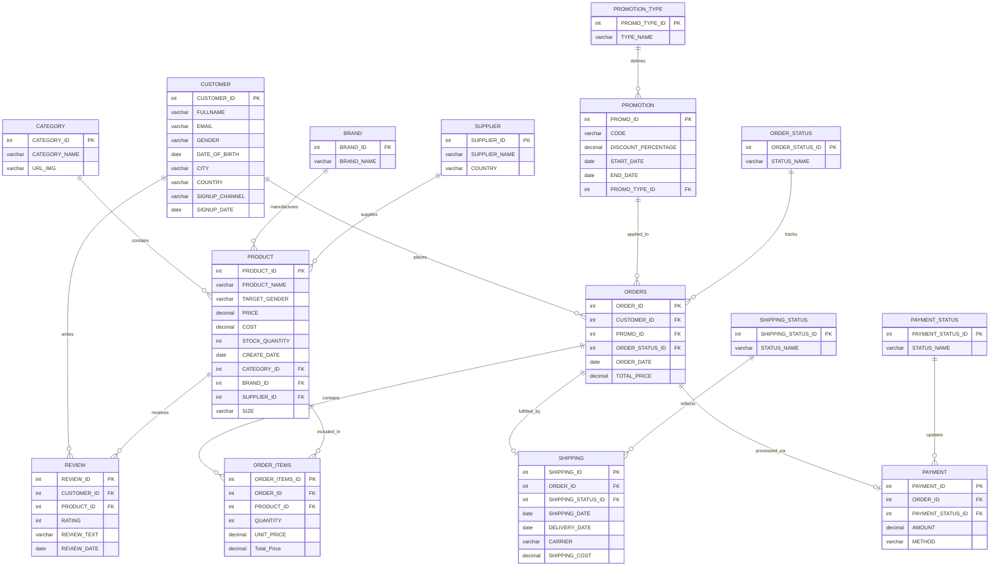

<div align="center">

# ✦ AURA ✦
### E-Commerce Data Analytics — Graduation Project

</div>
<div align="left">

## 🛠️ Technologies Used
**SQL Server**<br>
**Python**<br>
**Excel**<br>
**Power BI**

---

## 📊 Project Information
**Status:** Completed<br>
**Tables:** 14<br>
**License:** Educational

</div>

## ✦ &nbsp; About the Project

**AURA** is a fictional e-commerce platform selling clothing, shoes, bags, and accessories.
This project simulates a complete, real-world data analytics pipeline built entirely from scratch —
from database design to a fully interactive Power BI dashboard.

The dataset was **custom-designed and generated** for this graduation project (not sourced from Kaggle
or any public dataset), simulating realistic customer behavior, orders, payments, shipping, and
product reviews across the period **2024 – 2026**.

<br>

## ✦ &nbsp; Tech Stack

| Layer | Tools Used |
|---|---|
| **Database Design** | SQL Server (T-SQL) — 14 normalized tables, Views, Computed Columns |
| **Data Generation** | Python (`Faker`, `pandas`) |
| **Data Analysis** | Python (`pandas`, `matplotlib`, `seaborn`) via SQL connection (`pyodbc`) |
| **Reporting** | Microsoft Excel — Pivot Tables, Slicers, Charts |
| **Visualization** | Power BI — 5-page interactive dashboard, DAX measures |

<br>

## ✦ &nbsp; Entity Relationship Diagram

The database consists of **14 relational tables** covering the full e-commerce lifecycle:
Customers, Products, Categories, Brands, Suppliers, Orders, Order Items, Payments, Shipping,
Promotions, and Reviews — with dedicated lookup tables for statuses (Order, Payment, Shipping)
to keep the schema normalized.



### Table reference

| Table | Purpose | Key Relationships |
|---|---|---|
| `CUSTOMER` | Stores customer demographics, location, and signup info | Referenced by `ORDERS`, `REVIEW` |
| `CATEGORY` | Product categories (Clothing, Shoes, Bags, Kids Wear, etc.) | Referenced by `PRODUCT` |
| `BRAND` | Product manufacturing brands (Pulse, Urbanix, Northline, etc.) | Referenced by `PRODUCT` |
| `SUPPLIER` | Vendors supplying the products across regions | Referenced by `PRODUCT` |
| `PRODUCT` | Product catalog containing pricing, cost, size, and stock | → `CATEGORY`, `BRAND`, `SUPPLIER` <br> Referenced by `ORDER_ITEMS`, `REVIEW` |
| `PROMOTION_TYPE`| Defines campaign types for promotions | Referenced by `PROMOTION` |
| `PROMOTION` | Discount codes, discount percentages, and active periods | → `PROMOTION_TYPE` <br> Referenced by `ORDERS` |
| `ORDER_STATUS`| Lookup table for order progression (e.g., Processing, Shipped) | Referenced by `ORDERS` |
| `ORDERS` | High-level customer order transactions and total prices | → `CUSTOMER`, `PROMOTION`, `ORDER_STATUS` <br> Referenced by `ORDER_ITEMS`, `PAYMENT`, `SHIPPING` |
| `ORDER_ITEMS` | Granular line items detailing specific products and quantities per order | → `ORDERS`, `PRODUCT` |
| `PAYMENT_STATUS`| Lookup table for payment outcomes (e.g., Paid, Failed) | Referenced by `PAYMENT` |
| `PAYMENT` | Financial transaction records tracking payment methods and amounts | → `ORDERS`, `PAYMENT_STATUS` |
| `SHIPPING_STATUS`| Lookup table for delivery progression (e.g., Delivered, Returned) | Referenced by `SHIPPING` |
| `SHIPPING` | Logistical details, delivery timelines, carriers, and shipping costs | → `ORDERS`, `SHIPPING_STATUS` |
| `REVIEW` | Post-purchase customer feedback and quantitative ratings | → `CUSTOMER`, `PRODUCT` |

<br>

## ✦ &nbsp; Power BI Dashboard

The dashboard is organized into **5 pages**, each answering a different business question. The visual identity utilizes a custom dark-gold UI (`#0b0805` background, `#d5ad5d` gold highlights) for premium branding and readability.

| Page | Focus |
|---|---|
| 🏠 **Home** | Landing page / brand identity |
| 📊 **Sales Overview** | High-level KPIs — revenue, orders, average order value, geographic breakdown |
| 👤 **Customer Analytics** | Demographics, signup channels, customer age distributions |
| 📦 **Product & Profit** | Profitability, brand comparison, price vs. rating analysis |
| 🚚 **Shipping & Payments** | Delivery performance by carrier, returned/cancelled rates, payment methods |

### Dashboard Previews

<div align="center">
  <a href="https://github.com/elkrdawy111/ecommerce-data-analytics-graduation-project/blob/main/Photo&Icon/POWERBI-DASHBOARD-1.png?raw=true">
    
  </a>
  <a href="https://github.com/elkrdawy111/ecommerce-data-analytics-graduation-project/blob/main/Photo&Icon/POWERBI-DASHBOARD-2.png?raw=true">
    
  </a>
  <a href="https://github.com/elkrdawy111/ecommerce-data-analytics-graduation-project/blob/main/Photo&Icon/POWERBI-DASHBOARD-3.png?raw=true">
    
  </a>
  <a href="https://github.com/elkrdawy111/ecommerce-data-analytics-graduation-project/blob/main/Photo&Icon/POWERBI-DASHBOARD-4.png?raw=true">
    
  </a>
</div>


<br>

## ✦ &nbsp; Excel Dashboard

Complementing the Power BI suite is an interactive **Excel Dashboard**, allowing stakeholders to filter and review sales volumes and demographic summaries natively through Slicers and Pivot Tables.

<div align="center">
  
</div>

<br>

## ✦ &nbsp; Key Insights

- 📈 Total Revenue: **$720.97K** across 180 orders
- 💰 Profit Margin: **~44%** overall
- 🚫 Cancelled/Returned Rate: **18.33%**
- ⭐ Average Product Rating: **4.26 / 5**
- 🛍️ **Customer Behavior**: Specific age brackets heavily dominate the active customer base, validating targeted marketing campaigns (e.g., Google Ads).
- 🚚 **Logistics Friction**: Variations in Average Delivery Time exist between carriers, directly correlating with the percentage of Returned Orders.

<br>

## ✦ &nbsp; Python Data Analysis

The project includes a detailed Jupyter Notebook (`Python/ecommerce-project.ipynb`) that acts as the bridge between the raw SQL database and the final BI dashboards. 

### 1. Database Connection & Data Extraction
Using the `pyodbc` library, the notebook establishes a direct ODBC connection to the SQL Server database (`DESKTOP-UFA9267\SQLEXPRESS`). The data is extracted directly from the `VW_DASHBOARD_DATA` view into a Pandas DataFrame using `pd.read_sql`.

### 2. Data Profiling & Cleaning
The dataset undergoes structural profiling using `df.info()` and `df.describe()`. Programmatic checks are performed to ensure data integrity by verifying there are no null values (`df.isna().sum()`) or duplicate records (`df.duplicated().sum()`).

### 3. Exploratory Data Analysis (EDA)
An extensive EDA phase is conducted to understand customer demographics and purchasing behavior. Using `seaborn` and `matplotlib`, statistical distributions are mapped out, such as Kernel Density Estimate (KDE) histograms for Customer Age.

### 4. Custom Visual Identity
To maintain a premium, cohesive brand aesthetic across the entire project, the Python visualizations use customized `matplotlib.rcParams`. The plots are styled with a dark background (`#0b0805`) and gold accents (`#d5ad5d`), perfectly matching the AURA Power BI dashboard theme.
## ✦ &nbsp; Python Data Analysis
The project includes a detailed Jupyter Notebook (`Python/ecommerce-project.ipynb`) that acts as the bridge between the raw SQL database and the final BI dashboards. It is heavily focused on Exploratory Data Analysis (EDA) and business storytelling through data visualization.
### 1. Database Connection & Data Extraction
Using the `pyodbc` library, the notebook establishes a direct ODBC connection to the SQL Server database (`DESKTOP-UFA9267\SQLEXPRESS`). The data is extracted directly from the `VW_DASHBOARD_DATA` view into a Pandas DataFrame using `pd.read_sql`.
### 2. Data Profiling & Cleaning
The dataset undergoes structural profiling using `df.info()` and `df.describe()`. Programmatic checks are performed to ensure data integrity by verifying there are no null values (`df.isna().sum()`) or duplicate records (`df.duplicated().sum()`).
### 3. Custom Visual Identity
To maintain a premium, cohesive brand aesthetic across the entire project, the Python visualizations use customized `matplotlib.rcParams`. The plots are styled with a dark background (`#0b0805`), gold text/accents (`#d5ad5d`), and the `YlOrBr` (Yellow-Orange-Brown) color palette to perfectly match the AURA Power BI dashboard theme.
### 4. Exploratory Data Analysis (EDA) & Charts
The notebook features 11 insightful visualizations built with `seaborn` and `matplotlib`, strategically grouped to answer core business questions:
#### A. Customer Demographics & Acquisition
* **Histogram For Age (`sns.histplot`)**: Visualizes the age distribution of the customer base (using a Kernel Density Estimate) to identify the core purchasing demographic.
* **Customers by Sign-Up Channel and Gender (`sns.countplot`)**: Analyzes which marketing channels (e.g., Direct, Google Ads) attract the most users and breaks them down by gender, guiding targeted ad spend.
* **Total Orders By City (`sns.barplot`)**: Maps out geographical hotspots, identifying the cities with the strongest market penetration.
#### B. Time-Series Trends
* **Total Price By Date (`sns.lineplot`)**: Tracks monthly revenue fluctuations to spot seasonal trends and high-performing sales periods.
* **Total Profit by Date (`sns.lineplot`)**: Tracks monthly profit trends, ensuring that spikes in revenue are actually translating to bottom-line success.
#### C. Product & Brand Performance
* **Top 10 Orders By Product (`sns.barplot`)**: Looks at pure transaction volume—identifying the most frequently purchased items.
* **Top 10 Sales By Product (`sns.barplot`)**: Identifies the specific products generating the highest revenue.
* **Total Sales by Category (`sns.barplot`)**: Provides a macro-level view of which departments (e.g., Clothing vs. Shoes) dominate the business.
* **Total Profit By Brand (`sns.barplot`)**: Crucial for vendor management, showing which brands offer the best margins and contribute the most to actual profit.
#### D. Operations & Payments
* **Order Status (`plt.pie`)**: Shows the proportion of orders delivered vs. returned, acting as a quick health check on fulfillment efficiency.

## ✦ &nbsp; Repository Structure

```
AURA-ecommerce-analytics/
│
├── README.md
├── Database(create data by sql)/
│   ├── E_COMMERCE_DB_DDL (Create database).sql.sql  # DDL — table definitions
│   ├── E_COMMERCE_DB_DATA (fil data).sql            # Generated INSERT statements
│   └── E_COMMERCE_QUERIERS.sql                      # Analysis-ready SQL views
│
├── Python/
│   ├── ecommerce-project.ipynb                      # EDA, data loading & profiling
│   └── VW_DASHBOARD_DATA.xlsx                       # Exported analytical dataset
│
├── E_COMMERCE.xlsx                                  # Pivot tables, charts, KPIs
├── e-commerce clothing.pbix                         # 5-page interactive dashboard
│
├── Dashboard/                                       # Power BI Screenshots
└── Photo/                                           # Icons, Backgrounds & Excel Screenshots

```

<br>


## ✦ &nbsp; Author

**Mohamed Amir Elkrdawy**  
Graduation Project — Data Creation, Analysis & Visualization
<div align="center">
  <a href="https://www.linkedin.com/in/mohamed-amiir11/">
    
  </a>
  <a href="https://www.kaggle.com/mohamedamiralkrdawy">
    
  </a>
  <a href="mailto:m.ekrdawy@gmail.com">
    
